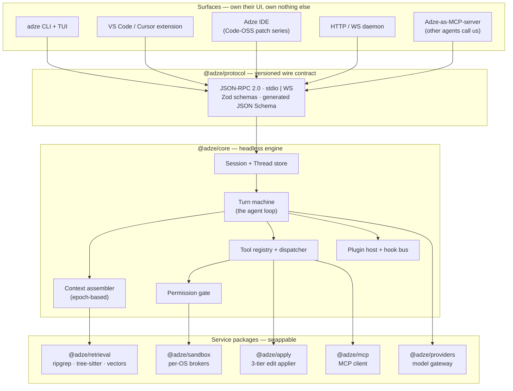
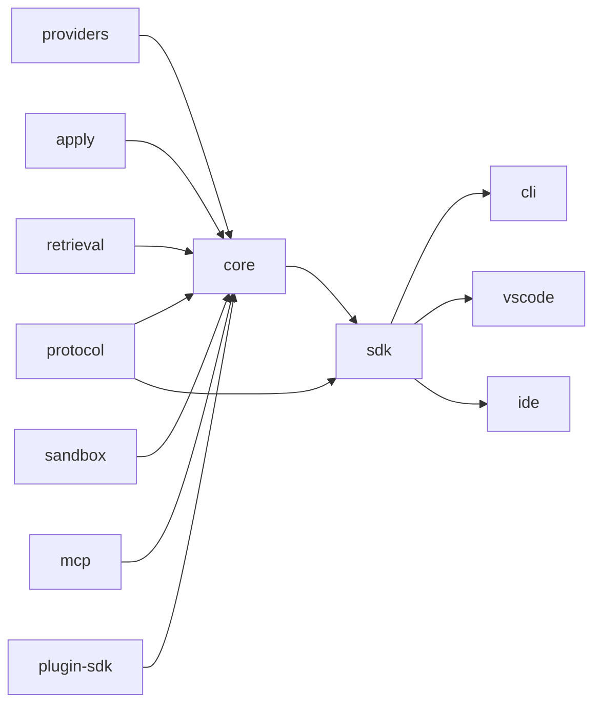
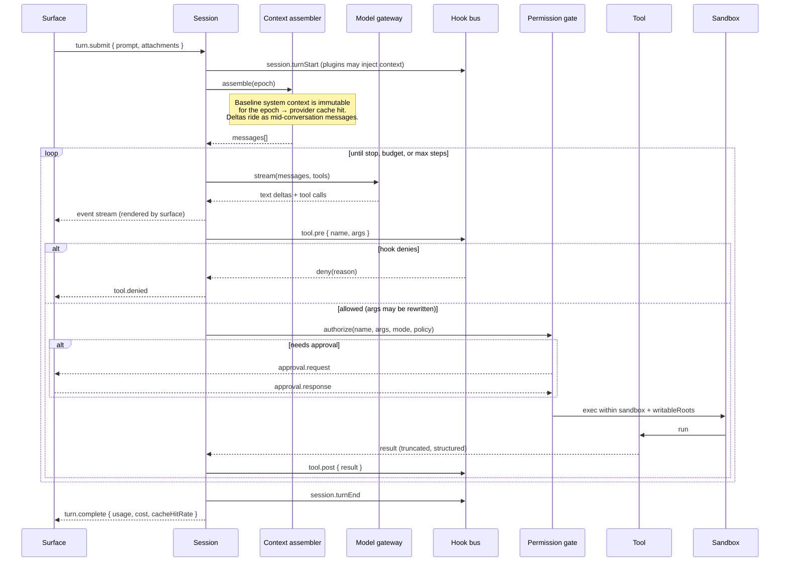
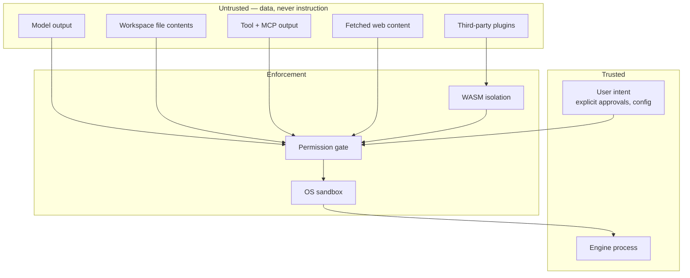

# Adze Architecture

This document describes how Adze is put together and why. It is the map; the
[ADRs](adr/) are the reasoning behind individual turns in the road.

- [1. Design goals](#1-design-goals)
- [2. The one structural decision that matters](#2-the-one-structural-decision-that-matters)
- [3. System layers](#3-system-layers)
- [4. Package graph and dependency rules](#4-package-graph-and-dependency-rules)
- [5. Anatomy of a turn](#5-anatomy-of-a-turn)
- [6. Components](#6-components)
- [7. Extension points](#7-extension-points)
- [8. Trust boundaries](#8-trust-boundaries)
- [9. Performance targets](#9-performance-targets)
- [10. What is deliberately not built](#10-what-is-deliberately-not-built)

---

## 1. Design goals

Ordered. When two conflict, the earlier one wins, and that ordering is the actual
content of this section.

1. **The engine is embeddable and headless.** Anyone can build a surface on Adze
   without asking us. This is the whole product thesis.
2. **Local-first.** No code leaves the machine without an explicit, visible
   opt-in.
3. **Edits are safe.** The applier refuses to write a file it has broken. A
   refused edit is a good outcome; a corrupted file is not.
4. **Every action is gated.** An agent cannot act outside the permission its user
   granted.
5. **Extensible without forking.** Six plugin surfaces, so the answer to "can I
   change this?" is almost always yes.
6. **Reproducible.** Any number we publish can be re-run by a stranger.
7. **Fast enough to feel native.** Latency budgets in §9 are requirements.

### Non-goals

- **A hosted service.** Adze is software you run. No accounts, no backend.
- **Being a model lab.** We route to models; we do not train them.
- **Beating everything on every benchmark.** We target boards that are
  contamination-controlled and honest. See [the policy](../benchmarks/strategy.md).
- **Parity with proprietary VS Code extensions.** Legally impossible, and
  pretending otherwise misleads users. See [ADR-0009](adr/0009-extension-gallery.md).

---

## 2. The one structural decision that matters

Before the diagrams, the reasoning that produced them.

Surveying this category in 2026 gives an unusually clean natural experiment,
because a lot of well-funded, well-engineered projects died and a lot survived.

| Outcome | Projects | Shape |
| --- | --- | --- |
| Thriving | opencode, Codex CLI, Gemini CLI, OpenHands, Cline, goose | Engine-first, many surfaces |
| Archived or absorbed | Void, Roo Code, Continue, Cody | Single surface, or monetized the registry |

Void was an editor fork and nothing else; when maintenance lapsed there was no
other surface carrying users. Roo Code was an extension and nothing else.
Continue was an extension plus a proprietary hub, and the hub was the business.

Every survivor separated the agent engine from the thing you look at.

So Adze inverts the usual build order. **The engine is the product and the
surfaces are distribution.** Concretely, three rules fall out of that, and they
are enforced in review:

1. `@adze/core` imports nothing from any surface and renders nothing. It emits
   structured events.
2. Surfaces communicate with the engine *only* through `@adze/protocol`. If the
   CLI can do something the extension cannot, the protocol is missing a message.
3. Plugins cannot inject UI into the engine. UI extension happens per-surface.

Rule 2 is the load-bearing one. It is what prevents the CLI, the extension, and
the IDE from silently becoming three different products with three different bug
surfaces — which is the failure that makes multi-surface projects collapse back
to one surface.

---

## 3. System layers



Two things to notice.

**The engine can be in-process or out-of-process.** The CLI runs it in-process
for startup latency. The IDE runs it as a sidecar so a window closing does not
kill a running agent. Same protocol either way, so neither path is a special case.

**Adze is both an MCP client and an MCP server.** As a client it consumes the
existing ecosystem of MCP servers as tools. As a server it lets *other* agents —
including Claude Code and Codex — drive Adze's retrieval and apply engine. That
second direction costs little and makes Adze useful to people who have no
intention of switching tools.

---

## 4. Package graph and dependency rules



**The rules, enforced by review and by a dependency-cruiser check in CI:**

| Rule | Why |
| --- | --- |
| `protocol` depends on nothing but `zod` | It is the contract. A contract with dependencies is not a contract. |
| `core` never imports a surface | Reverse dependency = the engine renders = thesis broken |
| Service packages never import each other | Keeps them individually swappable and testable |
| Only surfaces import `sdk` | `sdk` is the public embedding API and its stability guarantees differ |
| Nothing imports `bench` | Benchmark code must not influence product code |

| Package | Responsibility | Stability |
| --- | --- | --- |
| `@adze/protocol` | Wire types, Zod schemas, JSON Schema codegen, version negotiation | Semver-strict from 0.2 |
| `@adze/core` | Sessions, turn machine, tool registry, permission gate, context assembly, plugin host | Semver-strict from 1.0 |
| `@adze/providers` | Model routing, streaming, token and cost accounting, cache-aware pricing | Internal |
| `@adze/apply` | Three-tier edit application with parse validation | Semver-strict from 0.2 |
| `@adze/retrieval` | ripgrep, tree-sitter symbols, local vectors, hybrid ranking | Internal |
| `@adze/sandbox` | Per-OS containment, `writableRoots`, command policy | Internal |
| `@adze/mcp` | MCP client and server, both transports | Tracks MCP spec |
| `@adze/plugin-sdk` | Manifest schema, hook bus, WASM host, authoring types | Semver-strict from 0.2 |
| `@adze/cli` | `adze` binary and TUI | User-facing |
| `@adze/sdk` | Public embedding API | Semver-strict from 1.0 |

---

## 5. Anatomy of a turn

The loop is deliberately boring. This is a conclusion from evidence rather than
an aesthetic preference: controlled experiments in 2026 that hold the model fixed
and swap the harness find aggregate score differences that are not statistically
significant, and the minimal reference harness — bash-only, linear history, one
subprocess per action — scores at or above elaborate ones.

Elaborate scaffolding buys perhaps 10–15 points against a *bad* baseline and
close to nothing against a good one. So we spend our complexity budget on
reliability, token efficiency, and safety instead of on clever control flow.



### Why the context assembler works in epochs

Provider prompt caching only pays if the prefix is byte-identical. Naively
reassembling a system prompt each step — re-sorting a file list, refreshing a
timestamp, re-ranking retrieval — invalidates the cache on every step, and cache
economics change effective cost by more than 10×.

So the assembler freezes a **baseline system context** for a *cache epoch*.
Within an epoch that prefix is immutable. New information arrives as ordered
mid-conversation messages instead of mutating the prefix. An epoch rolls only on
a structural change: a model switch, compaction, or a permission-mode change.

Cache hit rate is a first-class reported metric, in the protocol and in
benchmark output, because it is the difference between competitive and
uncompetitive cost per task.

---

## 6. Components

### 6.1 Tool surface

Bash-first with a small set of structured tools. The reasoning is in
[ADR-0004](adr/0004-tool-surface.md); the short version is that a capable model
with a real shell outperforms a large bespoke tool catalog, and the shell needs
nothing installed in the environment.

| Tool | Why it exists rather than being shell |
| --- | --- |
| `bash` | The workhorse. Stateless per call: one subprocess, no session drift. |
| `read` | Line-addressed with a token budget, so a 40k-line file cannot blow the context. |
| `edit` | Routes to `@adze/apply` for validation. Never blind text replacement. |
| `write` | Whole-file create/replace, gate-checked. |
| `glob` / `grep` | ripgrep-backed. Structured, ranked results instead of raw stdout. |
| `symbols` | tree-sitter symbol lookup. Cheaper and more precise than grep for "where is X defined". |
| `todo` | Explicit plan state. Measurably improves long-horizon coherence. |
| `task` | Spawns a subagent with a narrowed tool allowlist. |

**Native tool calling, not JSON-in-a-string.** Harnesses that make the model emit
every action as an escaped JSON blob pay a measured invalid-JSON rejection tax of
roughly 7% on open-weight models, concentrated in exactly the cheap models that
matter to us on cost. Native tool calling pays zero. We therefore require native
tool calling and treat a provider without it as degraded.

**Vision is a required path, not an add-on.** Text-only terminal harnesses lose
image-bearing tasks by a wide margin. Screenshots, diagrams, and failing-UI
photos flow through the protocol as first-class attachments.

### 6.2 The apply engine — three tiers

This is the component we most intend to be *measurably* better at, because a
mangled file is the failure users actually feel.

```
Tier 1  bounded-fuzzy search/replace       cheap, deterministic, no extra model
        ├─ exact match
        ├─ whitespace-normalized match
        ├─ indentation-tolerant match
        └─ anchored match (unique prefix/suffix lines)
        then: parse-validate. Broken parse ⇒ reject and fall through.

Tier 2  whole-file rewrite                 reliable, costs tokens
        Used when Tier 1 cannot find a unique safe match and the file is under
        the size threshold.

Tier 3  pluggable fast-apply provider      optional, never a hard dependency
        A specialized merge model. Configured, not assumed. Adze must work
        with it absent.
```

Every attempt is recorded: tier used, match strategy, whether parse validation
passed, retry count. That record is what makes **apply success rate per model per
tier** a publishable metric — see [ADR-0005](adr/0005-edit-application.md).

Parse validation degrades honestly. With tree-sitter grammars present it is a
real parse. Without them it falls back to a structural balance check (delimiters,
string and comment states, indentation coherence). The fallback catches the large
majority of real corruption and requires no WASM download, so the safety property
holds on a fresh clone.

### 6.3 Retrieval

Hybrid, local, and cheap-first:

1. **ripgrep** for literal and regex. Nothing beats it, and most lookups are
   lexical.
2. **tree-sitter** for symbols, definitions, and structure-aware chunk
   boundaries.
3. **Local vectors** (LanceDB) for semantic similarity — *optional* and off by
   default until a workspace is indexed.

Ordering matters: agentic grep plus symbol lookup outperforms vector search on
most repositories, which is why the strongest agents lean on tools rather than
indexes. Embeddings are a supplement for "find the thing I can't name", not the
primary path.

Everything runs on the machine. Remote embedding is a configuration a user can
choose, never a default. See [ADR-0006](adr/0006-retrieval.md).

### 6.4 Permission gate and sandbox

Two orthogonal axes, because collapsing them is what produces approval fatigue:

| Sandbox mode | Filesystem | Network |
| --- | --- | --- |
| `read-only` | read anywhere in workspace, write nothing | denied |
| `workspace-write` | write within `writableRoots` | denied unless allowlisted |
| `full-access` | unrestricted | unrestricted |

| Approval policy | Behavior |
| --- | --- |
| `untrusted` | approve every action |
| `on-request` | approve only what the sandbox would block *(default)* |
| `never` | never prompt; refuse rather than escalate |

Plus command-prefix rules (`allow` / `prompt` / `forbid`) so a specific command
can be permitted without widening the whole boundary.

Per-OS implementation, stated honestly: macOS via Seatbelt, Linux via
bubblewrap, **Windows has no OS-level containment yet** — the gate and policy
still apply but there is no kernel-level boundary. This is a gap across the
entire OSS agent ecosystem and it is on the roadmap as a differentiator rather
than a footnote. [ADR-0007](adr/0007-sandbox-and-permissions.md).

### 6.5 Plugin host

Six surfaces, shipping in this order:

| Surface | Mechanism | Isolation |
| --- | --- | --- |
| Tools | MCP (stdio, Streamable HTTP) | subprocess sandbox |
| Context providers | manifest, or WASM `provide_context` | WASM |
| Slash commands | declarative prompt template + tool allowlist | none needed |
| Hooks | lifecycle events, **can deny** | WASM + hard timeout |
| Subagents | declarative prompt, tools, model preference | inherits parent |
| UI | surface-side contribution | surface CSP |

Deny-capable hooks are the important one. A hook that can veto a tool call or an
edit lets a team encode its own policy without us building a policy feature, and
without a fork. [ADR-0008](adr/0008-plugin-architecture.md),
[full spec](../plugins/spec.md).

### 6.6 Surfaces

**CLI** — engine in-process for startup latency. Plain-text output first, TUI as
a layer on top, so Adze stays scriptable and CI-usable.

**VS Code / Cursor extension** — ships first and reaches users where they already
are, including Cursor's own users, with no build pipeline and no legal exposure.
Publishing an extension *to* the Marketplace is explicitly permitted; consuming
the Marketplace from a fork is not.

**Adze IDE** — a patch series over a pristine upstream Code-OSS checkout, never a
merged vendored fork. Measured churn drove this: the extension points we build on
saw ~0 commits over 5.8 months, while `product.json` and the workbench
registry saw ~30 each and upstream's own inline-chat directory saw 67. So we
register *alongside* upstream instead of patching it, and we keep our agent
behind upstream's Agent Host Protocol rather than rebuilding chat UI that
upstream now maintains and ships weekly.
[ADR-0010](adr/0010-ide-fork-strategy.md).

---

## 7. Extension points

Ranked by how much you can change without forking.

| I want to... | Do this | Fork needed? |
| --- | --- | --- |
| Add a tool | MCP server, or plugin `tools` | No |
| Change what context the agent sees | context provider plugin | No |
| Block or rewrite an action | `tool.pre` hook | No |
| Add a workflow | slash command + subagent | No |
| Use a different model | provider config | No |
| Change edit strategy | apply tier config, or a fast-apply provider | No |
| Swap retrieval | implement `RetrievalProvider` | No |
| Build a new surface | `@adze/sdk` + protocol | No |
| Change the turn machine | contribute to `@adze/core` | Upstream PR |

That table is the product. If a reasonable request lands in the bottom row, that
is a design bug worth an issue.

---

## 8. Trust boundaries



The claim we make is narrow and therefore keepable: **we do not claim to detect
prompt injection.** We claim that a successful injection still cannot execute an
unapproved command, because everything crosses the same gate and the gate answers
to user configuration rather than to model output.

Credentials live in the model gateway. They are never placed in model context,
tool arguments, or trajectory logs, and artifacts are scrubbed before write.

---

## 9. Performance targets

Requirements, not aspirations. Each gets a benchmark in `bench/suites`.

| Metric | Target | Measured by |
| --- | --- | --- |
| CLI cold start to first token | < 400 ms | `bench:latency` |
| Engine attach (IDE sidecar) | < 150 ms | `bench:latency` |
| `grep` on a 100k-file repo | < 250 ms | `bench:retrieval` |
| Cold symbol index, 100k files | < 60 s | `bench:index` |
| Incremental re-index on save | < 50 ms | `bench:index` |
| Tier-1 apply | < 10 ms | `bench:apply` |
| Prompt cache hit rate, steady state | > 85 % | trajectory logs |
| Engine idle RSS | < 120 MB | `bench:latency` |

Cache hit rate is on this list because it is a cost metric disguised as a
performance metric, and cost per task is the axis where an open-source tool can
credibly win.

---

## 10. What is deliberately not built

Recording rejected options is most of the value of an architecture document.

| Not building | Why |
| --- | --- |
| A forked chat UI in the IDE | Upstream ships an Agent Host Protocol; competing with a weekly-released subsystem is a permanent tax. [ADR-0010](adr/0010-ide-fork-strategy.md) |
| A fork of Void | Archived June 2026, months behind upstream, no maintainers. Its own fork ecosystem peaked at ~230 stars. Study it, do not inherit it. |
| A Theia or Zed base | EPL-2.0 / GPL-3.0 are incompatible with an Apache-2.0 product. [ADR-0002](adr/0002-language-and-runtime.md) |
| Our own benchmark harness | Harbor exists, is Apache-2.0, and is the official harness for the board we care about. Building our own would also make our numbers unverifiable. [ADR-0011](adr/0011-benchmark-harness.md) |
| Our own VS Code extension gallery | Open VSX exists and is legal. Building a gallery yields an empty store. [ADR-0009](adr/0009-extension-gallery.md) |
| A tool-calling protocol | MCP is the standard. Inventing one forfeits thousands of existing servers. |
| Server-side prompt assembly | Breaks local-first, which is the main product promise. |
| A plugin registry service, initially | A registry with no plugins is worthless. Git index plus npm until plugins exist. [ADR-0008](adr/0008-plugin-architecture.md) |
| Elaborate agent scaffolding | Evidence says it buys ~0 against a good baseline. Spend the budget on reliability. [ADR-0003](adr/0003-agent-loop.md) |

---

## Reading order for new contributors

1. This document.
2. [ADR-0001](adr/0001-engine-first-architecture.md) — the core bet.
3. [ADR-0003](adr/0003-agent-loop.md) and [ADR-0005](adr/0005-edit-application.md) — the two components most worth understanding.
4. [Benchmark policy](../benchmarks/strategy.md) — the evidence standard we hold ourselves to.
5. [Plugin spec](../plugins/spec.md) — the extensibility contract.
6. [Roadmap](../roadmap.md) — what is actually next.
