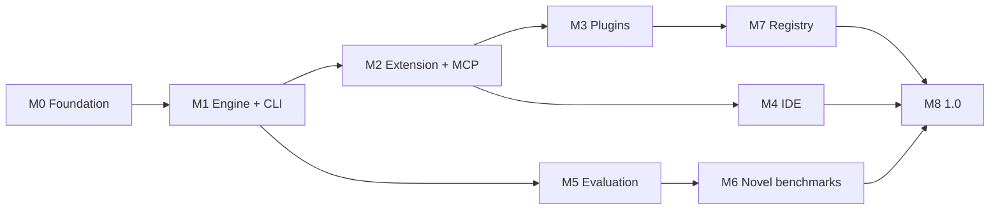

# Roadmap

Milestones are ordered by dependency and by how quickly each produces something a
stranger can use. Dates are deliberately absent — this is a new project and
inventing a schedule would be fiction. The *ordering* is the commitment.

Progress is tracked in [GitHub milestones](https://github.com/AyanB123/adze/milestones).

**This document says where the code is. [`plan.md`](plan.md) says what to do
next** — the prioritized work, the ledger of places a document and the code
disagree, and the consolidated list of decisions that a plausible-looking change
would reverse.

---

## Where the code actually is

Verified 2026-08-30 on Windows (win32 10.0.26200, Node 25.5.0, pnpm 10.20.0) by
deleting every `dist/` directory, rebuilding all 13 build targets from committed
source with the Turborepo cache explicitly bypassed, then re-running typecheck
against the freshly generated declarations so cross-package types resolve against
new output rather than stale artifacts. Lint, typecheck, and the full test suite
were run afterwards on the same tree.

| Package | State | Evidence |
| --- | --- | --- |
| `@adze/protocol` | Landed | typecheck clean · 72 tests · lint clean |
| `@adze/core` | Landed | typecheck clean · 308 tests · lint clean |
| `@adze/apply` | Landed | typecheck clean · 64 tests · lint clean |
| `@adze/providers` | Landed | typecheck clean · 135 tests · lint clean |
| `@adze/retrieval` | Landed, vectors deferred | typecheck clean · 250 tests, 2 skipped · lint clean |
| `@adze/sandbox` | Landed, **no Windows containment** | typecheck clean · 291 tests, 4 skipped · lint clean |
| `@adze/mcp` | Landed, client and server | typecheck clean · 83 tests · lint clean |
| `@adze/plugin-sdk` | Landed | typecheck clean · 153 tests · lint clean |
| `@adze/cli` | Landed | typecheck clean · 141 tests · lint clean |
| `@adze/sdk` | Landed | typecheck clean · 63 tests · lint clean |
| `apps/vscode` | Landed, **unpublished** | typecheck clean · 125 tests · lint clean |
| `plugins/` (8 first-party) | Landed | 202 tests · lint clean |
| `bench/harness` | Landed | 116 tests · lint clean |
| `apps/ide` | **Empty** | no source; M4 has not started |
| `apps/hub` | **Empty** | no source |

2,003 tests pass, with zero lint errors and zero lint warnings across 344 files.
Six tests are skipped, and both groups are conditional rather than broken: two in
`@adze/retrieval` require tree-sitter grammar binaries, and four in
`@adze/sandbox` are the real-containment tests, which need a host that actually
has Seatbelt or bubblewrap and therefore cannot run on Windows.

Two counts are easy to misread. `plugins/` is deliberately not a workspace
package, so Turborepo cannot see it and its 202 tests run from a separate root
script — that is why they once ran nowhere at all. And `bench/harness` is counted
here only because it is verified; nothing under `bench/` is imported by product
code.

### Three gaps stated plainly

These are the claims a reader is most likely to assume in our favour, so they are
recorded here rather than left to be discovered.

1. **There is no sandbox containment on Windows, and no syscall confinement
   anywhere.** `@adze/sandbox` has landed, and where a mechanism exists it is
   real: Seatbelt on macOS, bubblewrap on Linux, and opt-in Docker each deny
   writes outside the writable roots, deny network, and contain the subprocess
   tree, reporting `os-level` enforcement. The CLI wires these brokers into `run`,
   `chat`, and `doctor` — every containment claim is read from the plan the
   selected broker reports — so `os-level` is what a user gets on a macOS or
   Linux host with a usable mechanism, not only what the package can do. On
   **Windows there is nothing** — no
   restricted token, no job object, no AppContainer, because none of the three is
   reachable through `child_process.spawn`. A Windows plan reports `gate-only`,
   and what protects the machine there is the permission gate alone. In every
   row, including the `os-level` ones, the syscall surface is unrestricted: these
   mechanisms contain an agent doing damage, not code actively trying to escape,
   and each plan carries that as an explicit degradation. Enforcement is proven
   rather than described — `packages/sandbox/test/platform.test.ts` attempts a
   write outside the roots and requires it to be blocked — but those tests skip
   on Windows, which is the platform this verification ran on. They run in CI on
   the macOS and Ubuntu runners.
2. **No benchmark result has been published.** `apply-bench` runs and passes
   (`pnpm bench:list` prints the live case count), but that suite measures the
   applier against hand-written edits. It
   is not a measurement of any model, and its number is not a published result.
   Nothing has been run against SWE-rebench or Terminal-Bench. Of the two
   publication gates, the citation rule now runs on every generated report — a
   report that cannot cite its own run, because its harness version or invocation
   is missing, is refused. The three-point rule is implemented and tested but not
   yet called, because a Tier-1 report carries no baseline to compare against; it
   activates with the first report that has one. See M5.
3. **The live end-to-end run has been demonstrated once, on one model.** On
   2026-08-30 `adze run "fix the failing test"` completed a task in a scratch git
   repository against `kimi-k3` through an OpenAI-compatible endpoint: seven steps,
   39 seconds, stop reason `end-turn`, and a correct one-line fix that made a
   genuinely failing test pass. That closes M1's exit criterion, which had been the
   one thing standing between M1 and closed. Read the scope precisely — **one task,
   one model, one platform.** It is evidence that the assembled path works, not a
   measurement of how often it works, and no pass rate should be inferred from it.
   Nothing has been run against a paid frontier model, and the run happened outside
   this repository rather than against Adze's own source.

---

## Sequencing logic

Two constraints set the order.

**Ship where users already are, first.** The VS Code extension reaches VS Code,
Cursor, and Windsurf users in days with no build pipeline and no legal exposure.
The IDE fork takes 6–10 weeks and starts a permanent weekly-upstream maintenance
clock. Building the IDE before there are users to justify it is how projects in
this category die with an impressive artifact and no community.

**Evaluate from the first PR, not at the end.** Evaluation is how we find out
whether the architecture works. Tier-1 gate evals run on every pull request
starting in M1, when they are cheap to add and before there is anything to
rationalize.

---

## M0 — Foundation ✅

Repository, license, governance, tooling, architecture, and all thirteen ADRs.

Done. The point of writing every architectural decision *before* the code is that
the decisions are then checkable against evidence rather than reverse-engineered
from whatever got built.

---

## M1 — Engine and CLI — complete

**Goal: `adze "fix the failing test"` works end to end in a real repository.**

Demonstrated on 2026-08-30. In a scratch git repository holding a duration parser
that threw on unparseable input instead of returning `null`, `adze run "fix the
failing test"` reached `end-turn` in seven steps and 39 seconds against `kimi-k3`
over an OpenAI-compatible endpoint, and added the one-line guard that made the test
pass. The exact prompt was the goal sentence above, unedited.

Three things in that run are worth recording, because they are the first evidence
any of them works outside a test:

- **The permission gate refused a command and the agent adapted.** With
  `--approval never` and no OS-level containment on Windows, the gate denied `bash`
  rather than escalating, and the agent completed the task using the built-in
  `glob`, `read` and `edit` tools instead. A refusal being survivable rather than
  fatal is the behaviour ADR-0007 is built around.
- **The applier refused a bad edit and the model recovered from the message.** The
  model doubled a backslash inside a regex literal, searching for `/^(\\d+)/` where
  the file holds `/^(\d+)/`. All four strategies missed, the edit was refused as
  `not-found`, and the model fixed its own search block on the next turn. That is
  the round of feedback `CONTRIBUTING.md` calls the highest-value intervention in
  the loop, working on a real model for the first time. It is now a permanent
  regression case in both `packages/apply/test/` and `apply-bench`.
- **Cost reported `unknown` rather than zero,** because this model has no prices in
  the catalog. Cache accounting worked: 77% hit rate over 21,356 tokens.

**Scope, stated so it is not overread:** one task, one model, one platform. This is
evidence that the path works, not a measurement of how often it does.

Every deliverable below has landed, including the sandbox on the platforms where
containment is possible.

| Deliverable | State | Notes |
| --- | --- | --- |
| `@adze/protocol` | ✅ Landed | JSON-RPC types, Zod schemas, version negotiation |
| `@adze/apply` | ✅ Landed | All three tiers, parse validation, per-attempt telemetry |
| `@adze/core` | ✅ Landed | Turn machine, tool registry, permission gate, epoch context assembler |
| `@adze/providers` | ✅ Landed | Anthropic, OpenAI, OpenAI-compatible; cache-aware cost accounting |
| `@adze/retrieval` | ✅ Landed | ripgrep + tree-sitter symbols + RRF fusion. Vectors deferred. |
| `@adze/sandbox` | ✅ Landed, Windows excepted | Seatbelt, bubblewrap, opt-in Docker report `os-level`. Windows reports `gate-only` and confines nothing. Syscall surface unrestricted everywhere. |
| `@adze/cli` | ✅ Landed | `run`, `chat`, `apply`, `validate`, `doctor`, `models` |
| `bench/suites/apply-bench` | ✅ Landed | All cases pass (`pnpm bench:list` prints the live count); wired into CI |

**Done when:** the CLI completes a multi-step task in a real repository, every
tool call passes the gate, and `apply-bench` runs on every PR.

All three now hold. The third has held since `apply-bench` was wired into CI, the
second is asserted by the gate coverage tests and was then observed refusing a real
command in the live run, and the first was demonstrated on 2026-08-30 as described
above. What remains open is breadth rather than the criterion: one task on one model
is not a measurement, and the next useful evidence is the same run against a paid
frontier model and against Adze's own repository rather than a scratch one.

**Explicitly deferred:** TUI (plain output first keeps it scriptable), vector
search, plugins. Subagents are partly here — the built-in `task` tool and the
subagent runner are implemented in `@adze/core`; what M3 adds is the
*plugin-declared* subagent surface.

---

## M2 — Extension and MCP — substantially complete, exit criterion unmet

**Goal: installable from Open VSX and the Marketplace; MCP works both directions.**

`apps/vscode` and `@adze/mcp` have both landed. The milestone stays open on its
exit criterion rather than on its code: **nothing has been published to either
gallery**, so no user can install this yet.

The MCP half of the criterion is met. A server from the existing ecosystem —
`@modelcontextprotocol/server-everything`, published by the MCP maintainers and
not by us — was connected over stdio with no Adze-specific code on 2026-08-30: it
negotiated revision `2025-11-25`, discovered 13 tools, 7 resources, and 4 prompts
with zero warnings, and a tool call round-tripped through the permission gate and
returned a server-computed result.

| Deliverable | State | Notes |
| --- | --- | --- |
| `apps/vscode` | ✅ Landed, unpublished | Chat sidebar, inline diff review, approval UI, engine in-process |
| `@adze/mcp` client | ✅ Landed | stdio + Streamable HTTP; MCP servers as tools, each declaring effects the gate authorizes |
| `@adze/mcp` server | ✅ Landed | **Adze addressable by other agents.** Cheap, and makes Adze useful to people who will not switch tools. |
| Plugin surfaces 1–3 | ✅ Landed | Tools, context providers, slash commands — in `@adze/plugin-sdk`, ahead of schedule |
| Config system | ⬜ Not started | `.adze/config.jsonc`, `AGENTS.md` conventions. Only the provider slice exists, in strict JSON. |
| Ghost text | ✅ Landed, off by default | `InlineCompletionItemProvider`; `adze.inlineCompletion.enabled` defaults to false |

**Done when:** published to both galleries, and an MCP server from the existing
ecosystem works with no Adze-specific code.

---

## M3 — Plugins that can express a workflow — partly landed, ahead of schedule

Surfaces 4 and 5 landed early, during M2, because the first-party plugins needed
them. The milestone stays open: the WASM host is not built, `adze plugin dev` does
not exist, and the exit criterion is about other people, not about us.

| Deliverable | State | Notes |
| --- | --- | --- |
| Hooks (surface 4) | ✅ Landed | Lifecycle events with `allow` / `deny` / `modify`. **The one that makes policy a community problem instead of a roadmap item.** |
| Subagents (surface 5) | ✅ Landed | Declarative prompt, tool allowlist, model preference |
| WASM host | ⬜ **Not started** | `wasm32-wasip2` is a seam, not a runtime. The default `unavailableWasmRuntime` **fails the load** rather than skipping the module, because a policy hook that quietly never runs looks like a working policy and is not. What actually executes procedural plugin code today is a local ES module runtime. |
| `@adze/plugin-sdk` | 🚧 Partly landed | Manifest schema and authoring types landed. `adze plugin dev` with local override is **not built** — there is no `plugin` subcommand. |
| 5+ first-party plugins | ✅ Landed, 8 of them | Written to find out what the spec got wrong — and it did. See `plugins/FINDINGS.md`. |

The plugins were built to stress the spec, and the most serious thing they found
was a **policy bypass**: `edit.pre` is presented as the event for vetoing an edit,
but for core's whole-file `write` tool the payload carried no content, so a guard
inspecting `edits[].replace` refused a credential added via `edit` and allowed the
identical one written via `write`. That is now fixed — `EditPrePayload` carries
`content`, and the spec documents the payload so an author cannot repeat the
mistake by reading the spec alone.

Fixing it found the same bug twice more, which is the better argument for building
plugins before a registry than the original report was. `edit` accepts a whole-file
`replacement` that had the identical gap and had not been reported, and
`adze.secrets-guard` — the plugin written to prove policy can be encoded without
forking — was itself allowing credentials in that shape, because its workaround had
to key on the tool's name. A policy that enumerates tool names eventually misses
one. Both are recorded in `plugins/FINDINGS.md`.

**Done when:** a third party ships a plugin we did not help with. That is the real
test of the spec.

---

## M4 — Adze IDE

Only after the extension has users. See [ADR-0010](architecture/adr/0010-ide-fork-strategy.md).

| Deliverable | Notes |
| --- | --- |
| Build pipeline | Clone upstream at a tag, apply patch series, build. Never a vendored fork. |
| Branding patches | `product.json`, fresh win32 AppId GUIDs, icons, telemetry neutralization |
| Open VSX + CI audit | Recommendation-map pruning enforced as a **build failure** |
| AHP harness | Agent behind upstream's Agent Host Protocol — inherits sessions, persistence, multi-window |
| Streaming inline diff | View zones + custom undo grouping. One Ctrl+Z reverts an agent turn. |
| Inline edit overlay | The Cmd-K-equivalent widget |
| Release pipeline | 6 targets, signing, notarization, static-JSON update feed |
| Upstream merge bot | Nightly attempt, `rerere`, `jq` regeneration of `product.json`, "releases behind" alert above 3 |

**Done when:** a signed installer on all six targets auto-updates cleanly, and the
merge bot has tracked upstream for four consecutive weekly releases unattended.

---

## M5 — Evaluation infrastructure — Tier 1 only

Runs in parallel with M1–M2, not after.

Tier 1 is live: `apply-bench` runs on every pull request, passes all its cases
(`pnpm bench:list` prints the live count), and
uploads its run directory as an artifact. It is deterministic and free — no model
calls, no network, no container — which is also the limit of what exists. Nothing
containerized has been built.

| Deliverable | State | Notes |
| --- | --- | --- |
| `bench/harness` | 🚧 Partly landed | Tier-1 runner, case schema, statistics, report rendering, the publication gate, and the payload and history leakage assertions landed (116 tests). Harbor adapters are **not** built. |
| Two-container isolation | ⬜ Not started | No container code exists anywhere in `bench/`. |
| Leakage assertions | 🚧 Partly landed | Gold-patch-field, test-patch and future-history absence are asserted today by `checkPromptLeakage` and `checkHistoryIsolation`, as ordinary tests, so they are build failures on all three operating systems. The field guard is default-deny, so a dataset that adds a solution-bearing column is refused rather than passed. Network isolation and diff-only grading are **not implemented**: they are properties of a container, and the containers belong to Harbor. |
| Tier 1 / 2 / 3 pipelines | 🚧 Tier 1 only | Tiers 2 and 3 need the container work above. |
| Report format | 🚧 Partly landed | `report.md` genuinely emits limitations first, and that is reachable and tested: the limitations section is index 0, and a test compares its position against the first percentage in the rendered output. So it is a property of the generator rather than of the author. |
| Publication gates | 🚧 Partly enforced | `checkReportPolicy` runs inside `renderReportMarkdown`, so a report cannot be rendered without passing through it, and `adze-bench` exits 3 on a violation. A violating run is still written in full, because trajectories are required evidence and destroying them to hide a policy failure would be worse — the violation is printed into the report above every number instead. **Enforced:** report integrity (a headline that disagrees with the case outcomes; a severe-failure list that hides a case which applied when a refusal was required), the deterministic-versus-stochastic distinction (a non-deterministic suite reporting fewer than three attempts is refused), model-pin honesty, and that a report can cite its own run. **Not enforced:** the three-point comparison rule and the max-over-N detector — implemented and tested, but a Tier-1 report has no baseline and runs each case once, so calling them would evaluate absent data and look like enforcement while being none. They activate with the first report carrying a baseline or per-attempt rates. |
| First public report | ⬜ Not started | Whatever the number is. Including if it is bad. |

**Done when:** a stranger can re-run a published number from the artifacts alone.

---

## M6 — Benchmarks that do not exist yet

The IDE layer has no public evaluation. That is an opportunity, not a gap to
excuse.

| Suite | Why it is novel |
| --- | --- |
| **`nep-bench`** | Next-edit prediction from real commit sequences, scored by exact match, AST equivalence, and test pass. **No public NEP benchmark exists**, and it measures the feature Cursor is best known for and has no public number on. |
| **`apply-bench` (public)** | Apply success rate per model per tier. Nobody publishes this. |
| **`index-bench`** | Cold index time, incremental latency, peak RAM, retrieval precision@k at 10k/100k/1M files. |

Published as standalone, independently runnable benchmarks with permissive
licenses — useful to competitors too. Owning the evaluation for a layer is a
stronger long-term position than a leaderboard placement.

---

## M7 — Plugin registry

Only once roughly 20+ third-party plugins exist, per
[ADR-0008](architecture/adr/0008-plugin-architecture.md). A registry with no
plugins is worthless, and the extension points are not validated until someone
hits a wall.

Index service over the git index, OCI for WASM artifacts, cosign signatures,
invisible-Unicode scanning, namespace claims. **Free and unmetered, permanently.**

---

## M8 — 1.0

| Requirement |
| --- |
| Stable `@adze/protocol`, `@adze/core`, `@adze/sdk` with semver guarantees |
| Windows sandbox broker shipped, closing the ecosystem-wide gap |
| Three surfaces at feature parity through the protocol |
| Published results on SWE-rebench and Terminal-Bench with full artifacts |
| Trademark search and policy |
| **More than one maintainer with independent release authority** |
| Vector retrieval on by default with acceptable index cost |

---

## Continuous, not milestoned

- **Upstream tracking** — ~50 VS Code releases/year. One engineer's continuous
  attention from M4. Not budgeting this is what killed Void.
- **`apply-bench` growth** — every model failure becomes a permanent case.
- **License CI** — `NOASSERTION` gets a human reading the LICENSE file.
- **Security scanning** — invisible Unicode, install scripts, provenance.
- **ADRs** — every architectural change, including reversals.

---

## Known risks

| Risk | Mitigation | Residual |
| --- | --- | --- |
| Single maintainer | Explicit succession plan in GOVERNANCE.md; foundation donation as intended outcome | **High until M8.** The honest one. |
| Upstream cadence outpaces us | Thin patch series, AHP, merge bot, tracked "releases behind" | Medium |
| Benchmark costs | Tier 1 on cheap models; Tier 3 only pre-release; open-weight models at frontier parity for a fraction of the cost | Medium |
| AHP changes under us | Version negotiation; extension surface as fallback | Medium |
| Nobody adopts it | Extension-first distribution; MCP server so non-adopters still benefit | **High.** The real risk. |
| Provider API churn | AI SDK abstraction; adapters are data | Low |

The last row is worth stating plainly: the most likely failure mode is not
technical. It is building something good that nobody uses. That is why
distribution comes before the impressive artifact.
