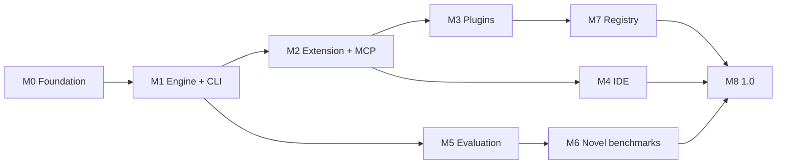

# Roadmap

Milestones are ordered by dependency and by how quickly each produces something a
stranger can use. Dates are deliberately absent — this is a new project and
inventing a schedule would be fiction. The *ordering* is the commitment.

Progress is tracked in [GitHub milestones](https://github.com/AyanB123/adze/milestones).

---

## Sequencing logic

Two constraints set the order.

**Ship where users already are, first.** The VS Code extension reaches VS Code,
Cursor, and Windsurf users in days with no build pipeline and no legal exposure.
The IDE fork takes 6–10 weeks and starts a permanent weekly-upstream maintenance
clock. Building the IDE before there are users to justify it is how projects in
this category die with an impressive artifact and no community.

**Evaluate from the first PR, not at the end.** Evaluation is how we find out
whether the architecture works. Tier-1 gate evals run on every pull request
starting in M1, when they are cheap to add and before there is anything to
rationalize.

---

## M0 — Foundation ✅

Repository, license, governance, tooling, architecture, and all twelve ADRs.

Done. The point of writing every architectural decision *before* the code is that
the decisions are then checkable against evidence rather than reverse-engineered
from whatever got built.

---

## M1 — Engine and CLI

**Goal: `adze "fix the failing test"` works end to end in a real repository.**

| Deliverable | Notes |
| --- | --- |
| `@adze/protocol` | JSON-RPC types, Zod schemas, version negotiation |
| `@adze/apply` | All three tiers, parse validation, per-attempt telemetry |
| `@adze/core` | Turn machine, tool registry, permission gate, context assembler |
| `@adze/providers` | Anthropic, OpenAI, OpenAI-compatible; cache-aware cost accounting |
| `@adze/retrieval` | ripgrep + tree-sitter symbols. Vectors deferred. |
| `@adze/sandbox` | Two-axis gate; macOS/Linux containment; Windows gate-only with a startup warning |
| `@adze/cli` | `adze run`, `adze chat`, `adze apply`, `adze doctor` |
| `bench/suites/apply-bench` | Tier-1 gate eval, running in CI |

**Done when:** the CLI completes a multi-step task in a real repository, every
tool call passes the gate, and `apply-bench` runs on every PR.

**Explicitly deferred:** TUI (plain output first keeps it scriptable), vector
search, plugins, subagents.

---

## M2 — Extension and MCP

**Goal: installable from Open VSX and the Marketplace; MCP works both directions.**

| Deliverable | Notes |
| --- | --- |
| `apps/vscode` | Chat sidebar, inline diff via decorations, engine in-process |
| `@adze/mcp` client | stdio + Streamable HTTP; MCP servers as tools |
| `@adze/mcp` server | **Adze addressable by other agents.** Cheap, and makes Adze useful to people who will not switch tools. |
| Plugin surfaces 1–3 | Tools, context providers, slash commands |
| Config system | `.adze/config.jsonc`, `AGENTS.md` conventions |
| Ghost text | `InlineCompletionItemProvider` — stable public API |

**Done when:** published to both galleries, and an MCP server from the existing
ecosystem works with no Adze-specific code.

---

## M3 — Plugins that can express a workflow

| Deliverable | Notes |
| --- | --- |
| Hooks (surface 4) | Lifecycle events with `allow` / `deny` / `modify`. **The one that makes policy a community problem instead of a roadmap item.** |
| Subagents (surface 5) | Declarative prompt, tool allowlist, model preference |
| WASM host | `wasm32-wasip2`, hard timeouts |
| `@adze/plugin-sdk` | Manifest schema, authoring types, `adze plugin dev` with local override |
| 5+ first-party plugins | Written to find out what the spec got wrong |

**Done when:** a third party ships a plugin we did not help with. That is the real
test of the spec.

---

## M4 — Adze IDE

Only after the extension has users. See [ADR-0010](architecture/adr/0010-ide-fork-strategy.md).

| Deliverable | Notes |
| --- | --- |
| Build pipeline | Clone upstream at a tag, apply patch series, build. Never a vendored fork. |
| Branding patches | `product.json`, fresh win32 AppId GUIDs, icons, telemetry neutralization |
| Open VSX + CI audit | Recommendation-map pruning enforced as a **build failure** |
| AHP harness | Agent behind upstream's Agent Host Protocol — inherits sessions, persistence, multi-window |
| Streaming inline diff | View zones + custom undo grouping. One Ctrl+Z reverts an agent turn. |
| Inline edit overlay | The Cmd-K-equivalent widget |
| Release pipeline | 6 targets, signing, notarization, static-JSON update feed |
| Upstream merge bot | Nightly attempt, `rerere`, `jq` regeneration of `product.json`, "releases behind" alert above 3 |

**Done when:** a signed installer on all six targets auto-updates cleanly, and the
merge bot has tracked upstream for four consecutive weekly releases unattended.

---

## M5 — Evaluation infrastructure

Runs in parallel with M1–M2, not after.

| Deliverable | Notes |
| --- | --- |
| `bench/harness` | Harbor adapters. **We build adapters, not a harness.** |
| Two-container isolation | Future git history deleted; only the committed diff crosses to a fresh verifier |
| Leakage assertions | Test-patch absence, gold-patch-field absence, future-history absence, network isolation — as **build failures** |
| Tier 1 / 2 / 3 pipelines | Per [ADR-0011](architecture/adr/0011-benchmark-harness.md) |
| Report format | Trajectories for every trial including failures, container digests, resource floor *and* ceiling, pinned model snapshots, seeds, cost with cache hit rate |
| First public report | Whatever the number is. Including if it is bad. |

**Done when:** a stranger can re-run a published number from the artifacts alone.

---

## M6 — Benchmarks that do not exist yet

The IDE layer has no public evaluation. That is an opportunity, not a gap to
excuse.

| Suite | Why it is novel |
| --- | --- |
| **`nep-bench`** | Next-edit prediction from real commit sequences, scored by exact match, AST equivalence, and test pass. **No public NEP benchmark exists**, and it measures the feature Cursor is best known for and has no public number on. |
| **`apply-bench` (public)** | Apply success rate per model per tier. Nobody publishes this. |
| **`index-bench`** | Cold index time, incremental latency, peak RAM, retrieval precision@k at 10k/100k/1M files. |

Published as standalone, independently runnable benchmarks with permissive
licenses — useful to competitors too. Owning the evaluation for a layer is a
stronger long-term position than a leaderboard placement.

---

## M7 — Plugin registry

Only once roughly 20+ third-party plugins exist, per
[ADR-0008](architecture/adr/0008-plugin-architecture.md). A registry with no
plugins is worthless, and the extension points are not validated until someone
hits a wall.

Index service over the git index, OCI for WASM artifacts, cosign signatures,
invisible-Unicode scanning, namespace claims. **Free and unmetered, permanently.**

---

## M8 — 1.0

| Requirement |
| --- |
| Stable `@adze/protocol`, `@adze/core`, `@adze/sdk` with semver guarantees |
| Windows sandbox broker shipped, closing the ecosystem-wide gap |
| Three surfaces at feature parity through the protocol |
| Published results on SWE-rebench and Terminal-Bench with full artifacts |
| Trademark search and policy |
| **More than one maintainer with independent release authority** |
| Vector retrieval on by default with acceptable index cost |

---

## Continuous, not milestoned

- **Upstream tracking** — ~50 VS Code releases/year. One engineer's continuous
  attention from M4. Not budgeting this is what killed Void.
- **`apply-bench` growth** — every model failure becomes a permanent case.
- **License CI** — `NOASSERTION` gets a human reading the LICENSE file.
- **Security scanning** — invisible Unicode, install scripts, provenance.
- **ADRs** — every architectural change, including reversals.

---

## Known risks

| Risk | Mitigation | Residual |
| --- | --- | --- |
| Single maintainer | Explicit succession plan in GOVERNANCE.md; foundation donation as intended outcome | **High until M8.** The honest one. |
| Upstream cadence outpaces us | Thin patch series, AHP, merge bot, tracked "releases behind" | Medium |
| Benchmark costs | Tier 1 on cheap models; Tier 3 only pre-release; open-weight models at frontier parity for a fraction of the cost | Medium |
| AHP changes under us | Version negotiation; extension surface as fallback | Medium |
| Nobody adopts it | Extension-first distribution; MCP server so non-adopters still benefit | **High.** The real risk. |
| Provider API churn | AI SDK abstraction; adapters are data | Low |

The last row is worth stating plainly: the most likely failure mode is not
technical. It is building something good that nobody uses. That is why
distribution comes before the impressive artifact.
